# Sequence Diagrams

## Contents

1. [Basic Syntax](#basic-syntax)
2. [Participants and Actors](#participants-and-actors)
3. [Message Types](#message-types)
4. [Activations](#activations)
5. [Alt/Else (Conditional Logic)](#altelse-conditional-logic)
6. [Opt (Optional)](#opt-optional)
7. [Par (Parallel)](#par-parallel)
8. [Loop](#loop)
9. [Break (Early Exit)](#break-early-exit)
10. [Notes](#notes)
11. [Sequence Numbers](#sequence-numbers)
12. [Links and Tooltips](#links-and-tooltips)
13. [Comprehensive Example: User Authentication Flow](#comprehensive-example-user-authentication-flow)
14. [API Request/Response Example](#api-requestresponse-example)
15. [Microservices Communication](#microservices-communication)
16. [Best Practices](#best-practices)

<example name="Basic Syntax">

## Basic Syntax

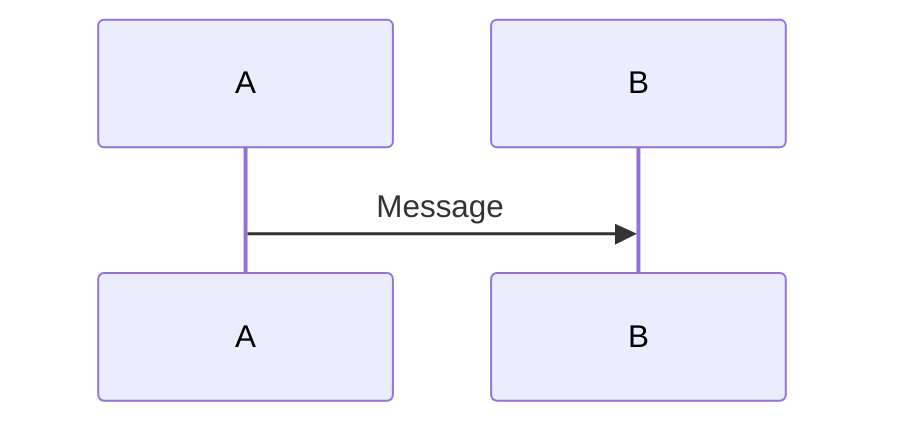
```mermaid
sequenceDiagram
    participant A
    participant B
    A->>B: Message
```

</example>

<example name="Participants and Actors">

## Participants and Actors

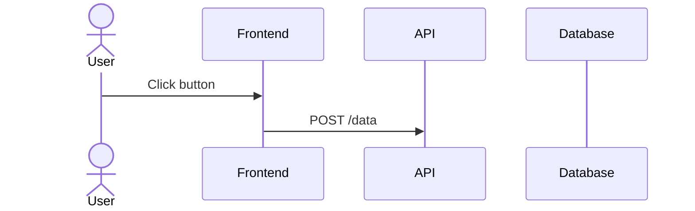
```mermaid
sequenceDiagram
    actor User
    participant Frontend
    participant API
    participant Database

    User->>Frontend: Click button
    Frontend->>API: POST /data
```

**Difference:**
- `participant` - System components (services, classes, databases)
- `actor` - External entities (users, external systems)

**Aliases:** give a participant a short ID and a display name with `as`. Use one whenever the name has spaces or punctuation, and write messages with the ID:

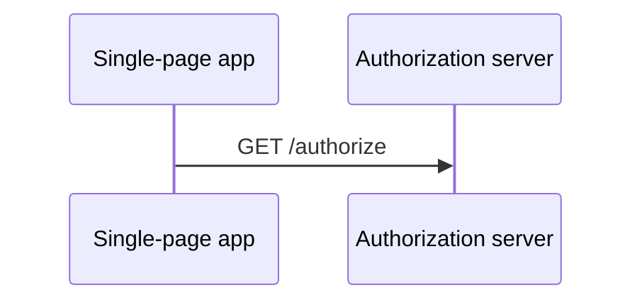
```mermaid
sequenceDiagram
    participant SPA as Single-page app
    participant Auth as Authorization server
    SPA->>Auth: GET /authorize
```

</example>

## Message Types

<example name="Synchronous Messages">

### Solid Arrow (Synchronous)
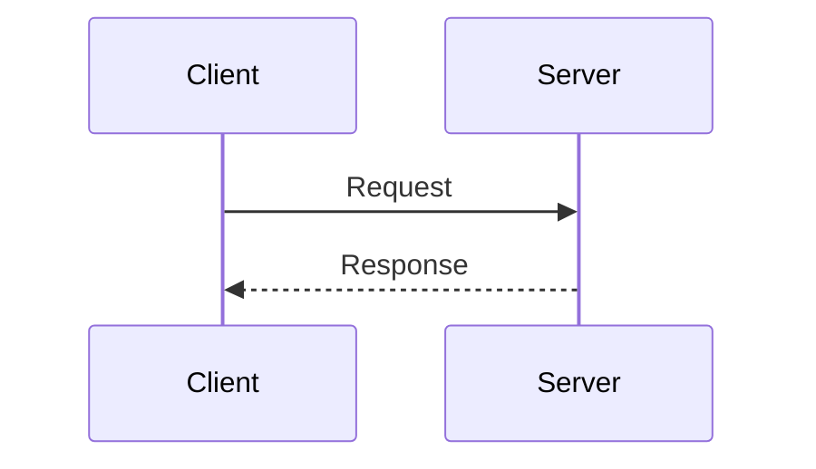
```mermaid
sequenceDiagram
    Client->>Server: Request
    Server-->>Client: Response
```

- `->>`  Solid arrow (request)
- `-->>`  Dotted arrow (response/return)

</example>

<example name="Asynchronous Messages">

### Open Arrow (Asynchronous)
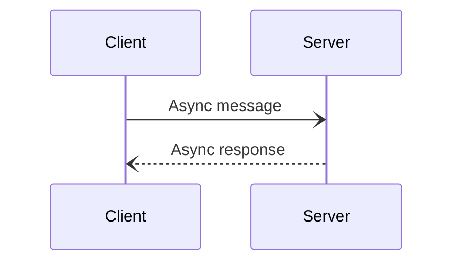
```mermaid
sequenceDiagram
    Client-)Server: Async message
    Server--)Client: Async response
```

- `-)` Solid open arrow
- `--)` Dotted open arrow

</example>

<example name="Delete Message">

### Cross/X (Delete)
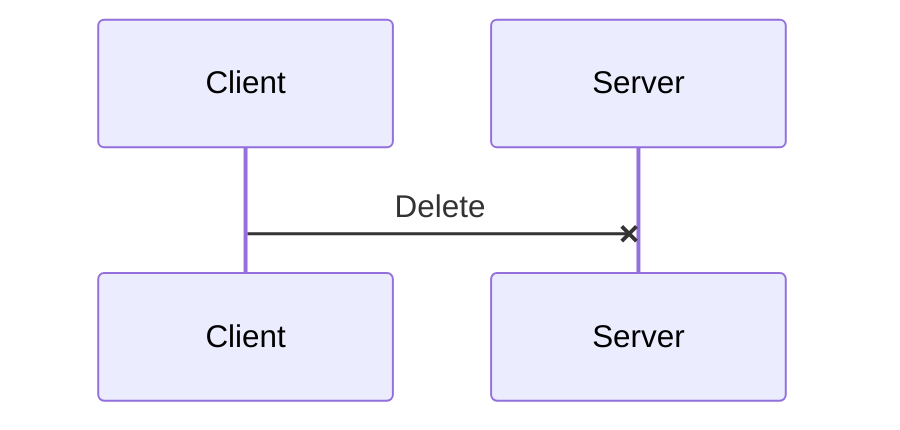
```mermaid
sequenceDiagram
    Client-xServer: Delete
```

</example>

<example name="Activations">

## Activations

Show when a participant is actively processing:

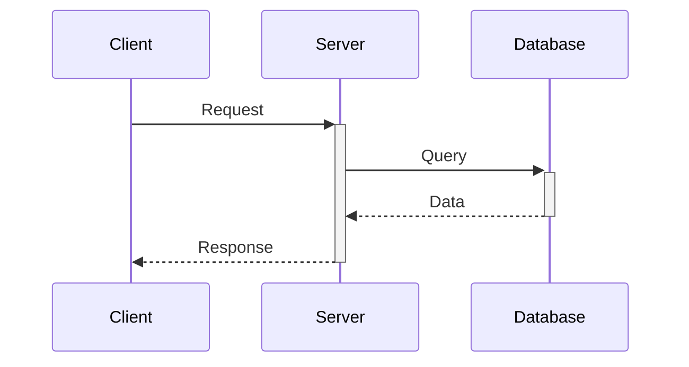
```mermaid
sequenceDiagram
    Client->>+Server: Request
    Server->>+Database: Query
    Database-->>-Server: Data
    Server-->>-Client: Response
```

- `+` right after the arrow activates the receiver (`Client->>+Server` activates Server)
- `-` right after the arrow deactivates the sender (`Server-->>-Client` deactivates Server)
- Deactivating a participant that is not active is an error, so pair each `-` with an earlier `+`

</example>

<example name="Alt/Else">

## Alt/Else (Conditional Logic)

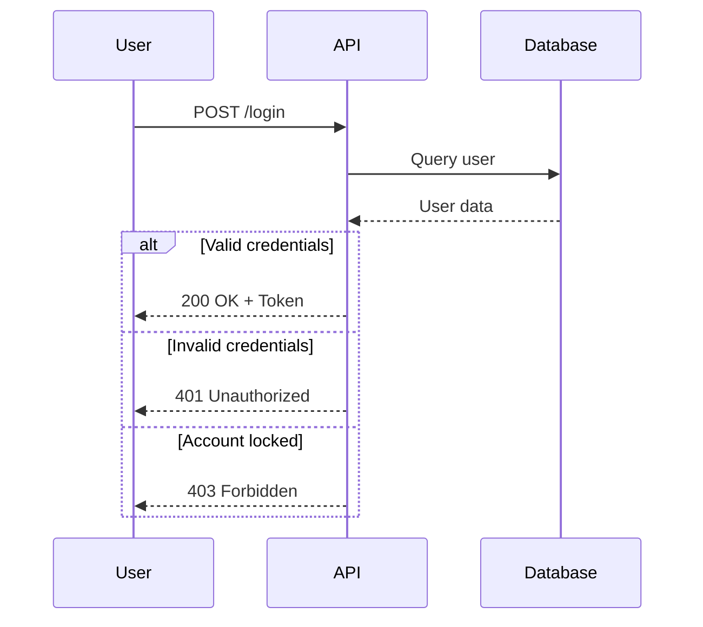
```mermaid
sequenceDiagram
    User->>API: POST /login
    API->>Database: Query user
    Database-->>API: User data

    alt Valid credentials
        API-->>User: 200 OK + Token
    else Invalid credentials
        API-->>User: 401 Unauthorized
    else Account locked
        API-->>User: 403 Forbidden
    end
```

</example>

<example name="Opt">

## Opt (Optional)

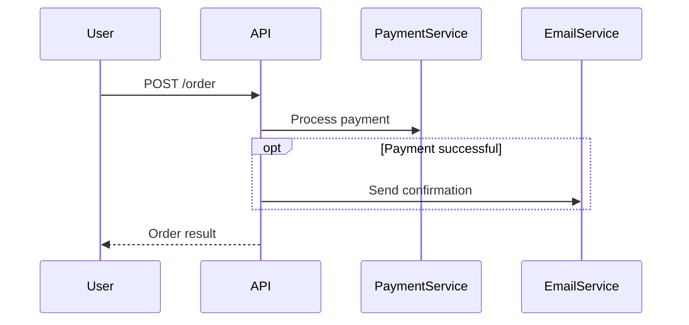
```mermaid
sequenceDiagram
    User->>API: POST /order
    API->>PaymentService: Process payment

    opt Payment successful
        API->>EmailService: Send confirmation
    end

    API-->>User: Order result
```

</example>

<example name="Par">

## Par (Parallel)

Show concurrent operations:

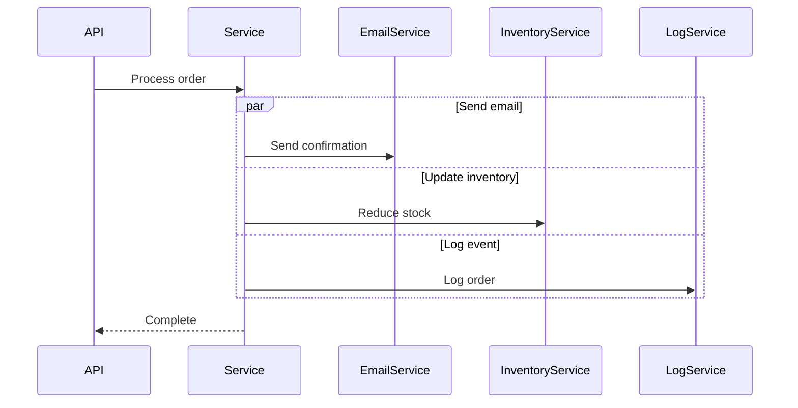
```mermaid
sequenceDiagram
    API->>Service: Process order

    par Send email
        Service->>EmailService: Send confirmation
    and Update inventory
        Service->>InventoryService: Reduce stock
    and Log event
        Service->>LogService: Log order
    end

    Service-->>API: Complete
```

</example>

<example name="Loop">

## Loop

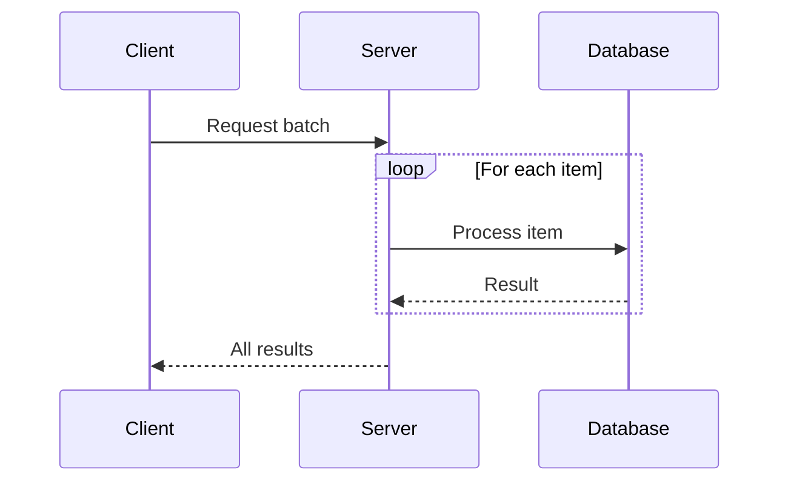
```mermaid
sequenceDiagram
    Client->>Server: Request batch

    loop For each item
        Server->>Database: Process item
        Database-->>Server: Result
    end

    Server-->>Client: All results
```

**Loop with condition:**
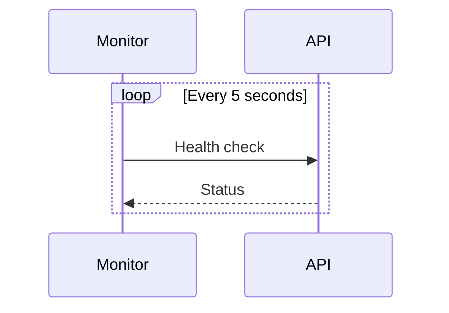
```mermaid
sequenceDiagram
    loop Every 5 seconds
        Monitor->>API: Health check
        API-->>Monitor: Status
    end
```

</example>

<example name="Break">

## Break (Early Exit)

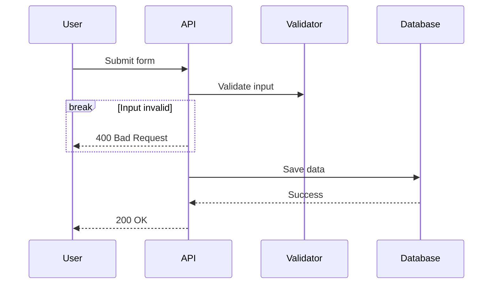
```mermaid
sequenceDiagram
    User->>API: Submit form
    API->>Validator: Validate input

    break Input invalid
        API-->>User: 400 Bad Request
    end

    API->>Database: Save data
    Database-->>API: Success
    API-->>User: 200 OK
```

</example>

<example name="Notes">

## Notes

### Note over single participant
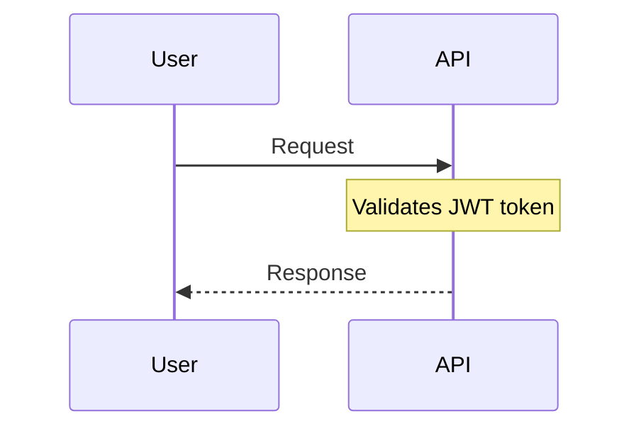
```mermaid
sequenceDiagram
    User->>API: Request
    Note over API: Validates JWT token
    API-->>User: Response
```

### Note spanning participants
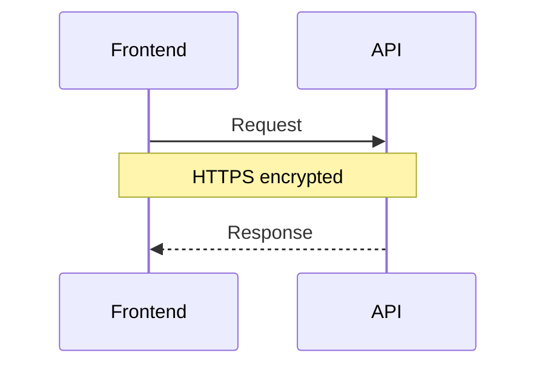
```mermaid
sequenceDiagram
    Frontend->>API: Request
    Note over Frontend,API: HTTPS encrypted
    API-->>Frontend: Response
```

### Right/Left notes
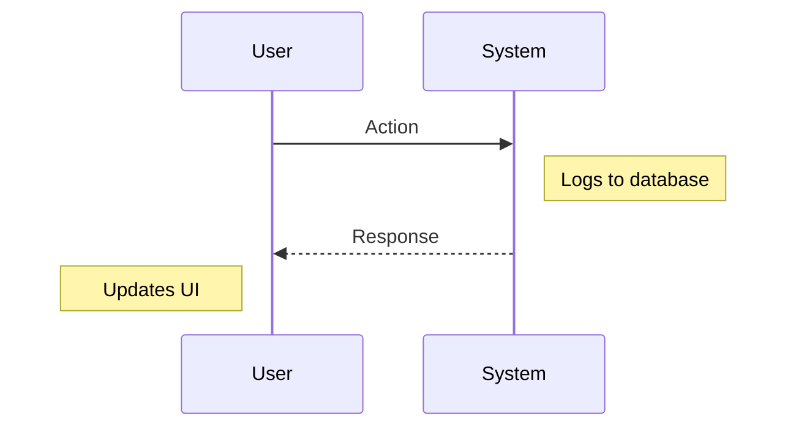
```mermaid
sequenceDiagram
    User->>System: Action
    Note right of System: Logs to database
    System-->>User: Response
    Note left of User: Updates UI
```

</example>

<example name="Autonumber">

## Sequence Numbers

Automatically number messages:

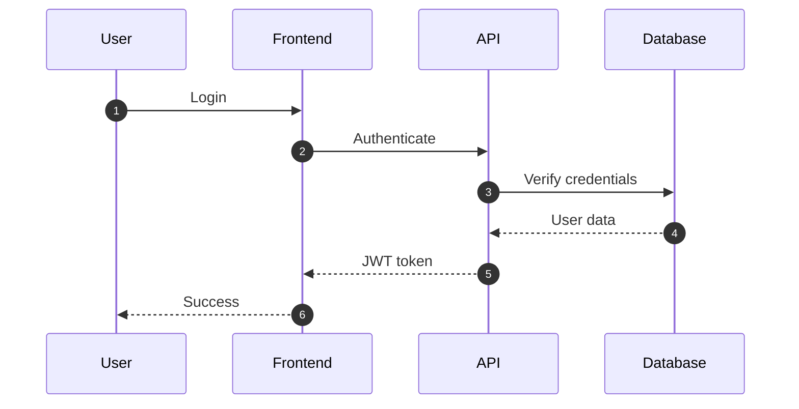
```mermaid
sequenceDiagram
    autonumber

    User->>Frontend: Login
    Frontend->>API: Authenticate
    API->>Database: Verify credentials
    Database-->>API: User data
    API-->>Frontend: JWT token
    Frontend-->>User: Success
```

</example>

<example name="Links">

## Links and Tooltips

Add clickable links:

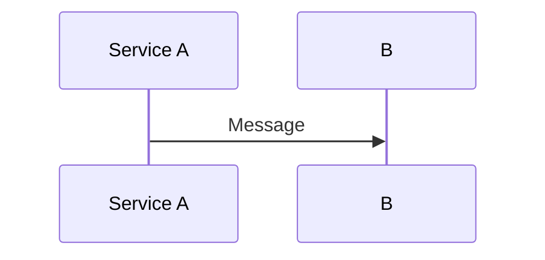
```mermaid
sequenceDiagram
    participant A as Service A
    link A: Dashboard @ https://dashboard.example.com
    link A: API Docs @ https://docs.example.com

    A->>B: Message
```

</example>

<example name="Auth Flow">

## Comprehensive Example: User Authentication Flow

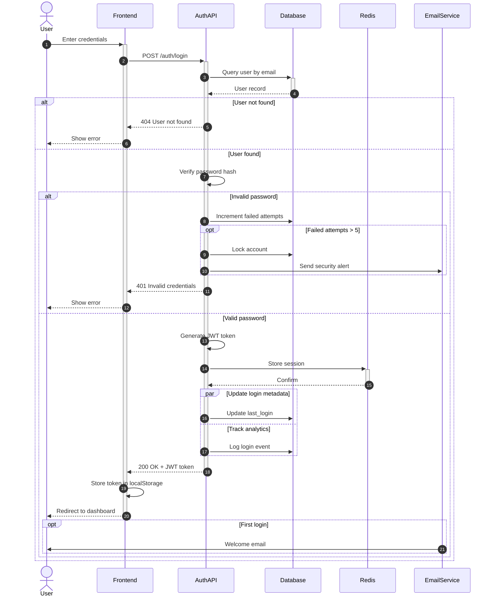
```mermaid
sequenceDiagram
    autonumber
    actor User
    participant Frontend
    participant AuthAPI
    participant Database
    participant Redis
    participant EmailService

    User->>+Frontend: Enter credentials
    Frontend->>+AuthAPI: POST /auth/login

    AuthAPI->>+Database: Query user by email
    Database-->>-AuthAPI: User record

    alt User not found
        AuthAPI-->>Frontend: 404 User not found
        Frontend-->>User: Show error
    else User found
        AuthAPI->>AuthAPI: Verify password hash

        alt Invalid password
            AuthAPI->>Database: Increment failed attempts

            opt Failed attempts > 5
                AuthAPI->>Database: Lock account
                AuthAPI->>EmailService: Send security alert
            end

            AuthAPI-->>Frontend: 401 Invalid credentials
            Frontend-->>User: Show error
        else Valid password
            AuthAPI->>AuthAPI: Generate JWT token
            AuthAPI->>+Redis: Store session
            Redis-->>-AuthAPI: Confirm

            par Update login metadata
                AuthAPI->>Database: Update last_login
            and Track analytics
                AuthAPI->>Database: Log login event
            end

            AuthAPI-->>-Frontend: 200 OK + JWT token
            Frontend->>Frontend: Store token in localStorage
            Frontend-->>-User: Redirect to dashboard

            opt First login
                EmailService->>User: Welcome email
            end
        end
    end
```

</example>

<example name="API Request/Response">

## API Request/Response Example

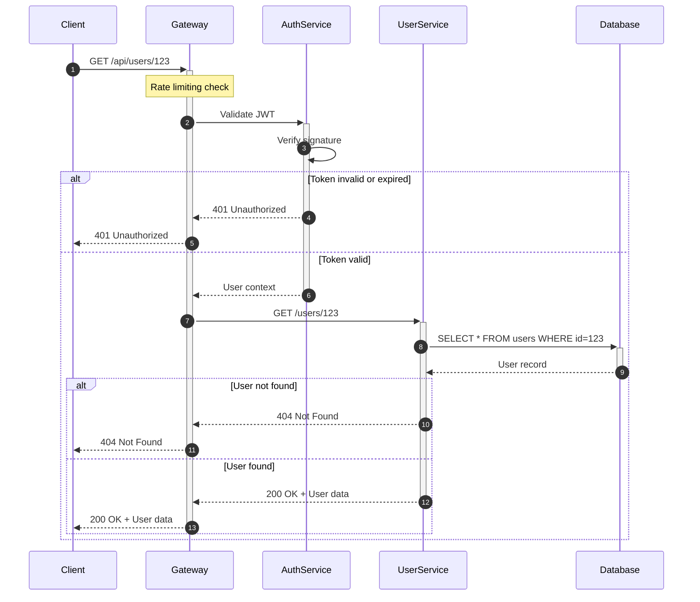
```mermaid
sequenceDiagram
    autonumber
    participant Client
    participant Gateway
    participant AuthService
    participant UserService
    participant Database

    Client->>+Gateway: GET /api/users/123
    Note over Gateway: Rate limiting check

    Gateway->>+AuthService: Validate JWT
    AuthService->>AuthService: Verify signature

    alt Token invalid or expired
        AuthService-->>Gateway: 401 Unauthorized
        Gateway-->>Client: 401 Unauthorized
    else Token valid
        AuthService-->>-Gateway: User context

        Gateway->>+UserService: GET /users/123
        UserService->>+Database: SELECT * FROM users WHERE id=123
        Database-->>-UserService: User record

        alt User not found
            UserService-->>Gateway: 404 Not Found
            Gateway-->>Client: 404 Not Found
        else User found
            UserService-->>-Gateway: 200 OK + User data
            Gateway-->>-Client: 200 OK + User data
        end
    end
```

</example>

<example name="Microservices">

## Microservices Communication

```mermaid
sequenceDiagram
    autonumber
    actor User
    participant Gateway
    participant OrderService
    participant PaymentService
    participant InventoryService
    participant NotificationService
    participant MessageQueue

    User->>+Gateway: POST /orders
    Gateway->>+OrderService: Create order

    OrderService->>+InventoryService: Check stock
    InventoryService-->>-OrderService: Stock available

    break Insufficient stock
        OrderService-->>Gateway: 400 Out of stock
        Gateway-->>User: Error message
    end

    OrderService->>OrderService: Reserve order
    OrderService->>+PaymentService: Charge customer

    alt Payment successful
        PaymentService-->>-OrderService: Payment confirmed
        OrderService-)MessageQueue: Publish OrderConfirmed event

        par Update stock
            MessageQueue-)InventoryService: Reduce stock
        and Notify customer
            MessageQueue-)NotificationService: Send confirmation
            NotificationService->>User: Email confirmation
        end

        OrderService-->>-Gateway: 201 Created
        Gateway-->>User: Order confirmed
    else Payment failed
        PaymentService-->>OrderService: Payment declined
        OrderService->>OrderService: Release reservation
        OrderService-->>Gateway: 402 Payment Required
        Gateway-->>User: Payment failed
    end
```

</example>

## Best Practices

1. **Order participants left-to-right by call chain** - User, Frontend, Backend, Database. This minimizes arrow crossings.
2. **Add `+`/`-` activations** to request/response pairs when processing time or nesting matters. Short diagrams can skip them.
3. **Wrap conditional logic in `alt`/`opt`/`break`/`par` blocks** - Never show branching without a control structure.
4. **Add `Note over` to explain non-obvious logic** - e.g., "Validates JWT signature before forwarding".
5. **One scenario per diagram** - Split "happy path" and "error path" into separate diagrams when combined length exceeds 20 messages. The comprehensive examples above combine paths to show more syntax at once; they are not target sizes.
6. **Add `autonumber`** for any diagram with more than 6 messages.
7. **Show every error response**, in an `alt`/`else` branch or a `break` block. Undocumented failure modes are the top cause of integration surprises.
8. **Use open arrows (`-)`) for messages to a queue or event bus**, where no reply comes back, and solid arrows (`->>`) for request/response.

